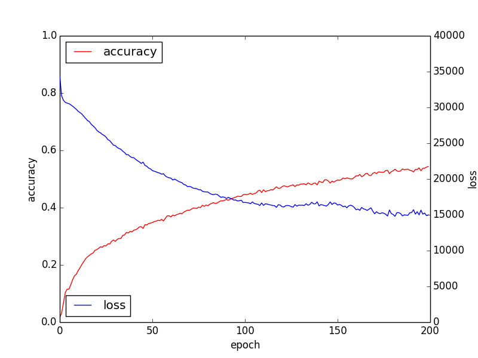

# Purpose


# Conclusion

# Results

## Preparation
Setup tensorflow-pi:
```sh
$ cd
$ git clone https://github.com/karaage0703/tensorflow-pi
$ cd tensorflow-pi/data
$ ./getCaltech101.sh 
$ python make_train_data.py 101_ObjectCategories
```

Clone this repository:
```sh
$ cd
$ git clone https://github.com/karaage0703/tensorflow-experiment
```

## Like MNIST NN
Using `cnn_mnist.py` for NN
```sh
$ cp ~/tensorflow-experiment/20170815_experiment/cnn_mnist.py ~/tensorflow-pi/cnn.py
```

Train:
```sh
$ cd ~/tensorflow-pi/
$ python train.py
```


```
step 0, training accuracy 0.0508475, loss nan
step 1, training accuracy 0.0508475, loss nan
```


## MNIST base NN using CIFAR10 CNN Layer
Using `cnn_cifar10_01.py` for NN
```sh
$ cp ~/tensorflow-experiment/20170815_experiment/cnn_cifar10_01.py ~/tensorflow-pi/cnn.py
```


```
elapsed_time:7920.29748917[sec]
test accuracy 0.429719
```


## MNIST base NN using CIFAR10 CNN Layer and Pooling Layer
Using `cnn_cifar10_02.py` for NN
```sh
$ cp ~/tensorflow-experiment/20170815_experiment/cnn_cifar10_01.py ~/tensorflow-pi/cnn.py
```



```
elapsed_time:9575.28440309[sec]
test accuracy 0.432842
```

